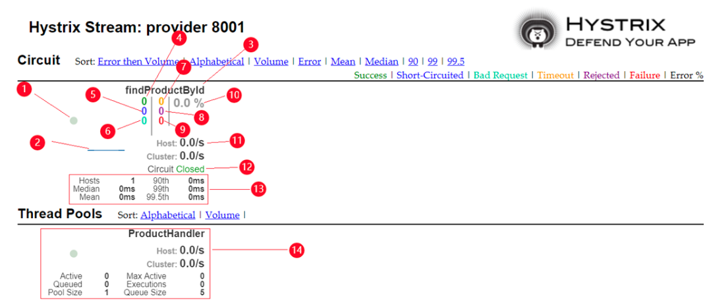

# Spring Cloud Eureka、Hystrix and Zuul Example

## 组件
- `eureka-service` - Eureka服务是服务注册中心
- `hello-server` - 将数据提供给客户端的服务
- `hello-client` - 客户端服务
- `zuul-service` - zuul网关服务

## 服务地址
Eureka：http://localhost:8070/

Zuul网关：http://localhost:8079

hello-client 路由：http://localhost:8079/api/client/rest/hello/client

hello-server 路由：http://localhost:8079/api/server/rest/hello/server

Hystrix Dashboard：http://localhost:8079/hystrix

Hystrix Stream: http://localhost:8072/actuator/hystrix.stream

#### 独立访问, hello-server启动两个服务测试单节点熔断后效果

hello-client：http://localhost:8072/rest/hello/client

hello-server：http://localhost:8071/rest/hello/server

hello-server：http://localhost:8077/rest/hello/server

## Hystrix Dashboard 分析


- 1、圆点：微服务的健康状态，颜色有绿色、黄色、橙色、红色，健康状态依次降低
- 2、线条：流量变化 
- 3、请求的方法 
- 4、成功请求（绿色）
- 5、短路请求（蓝色） 
- 6、坏请求（青色）
- 7、超时请求（黄色）
- 8、被拒绝的请求（紫色）
- 9、失败请求（红色）
- 10、最近10秒钟内请求错误的百分比 
- 11、请求频率 
- 12、熔断器状态 
- 13、数据延迟统计 
- 14、线程池

## 压测
线程数为 12，模拟 400 个并发请求，持续 60 秒
- wrk -t12 -c400 -d60s http://localhost:8079/api/client/rest/hello/client  


案例一(默认配置)：方法执行的超时时间1秒，如果断路器保护的方法调用超过20次，而且50%以上的调用在10秒的时间内发生失败，那么断路器就会进入打开状态。
所有后续的调用都将会由后备方法处理。在5秒之后，断路器进入半开状态，将会再次尝试调用原始的方法。
```shell
Running 1m test @ http://localhost:8079/api/client/rest/hello/client （压测时间1分钟）
    12 threads and 400 connections （共12个测试线程，400个连接）
                （平均值） （标准差）（最大值）（正负一个标准差所占比例）
    Thread Stats   Avg      Stdev     Max   +/- Stdev
    Latency    86.06ms  145.27ms   1.67s    92.87%
    （延迟）
    Req/Sec   243.48    175.65     1.78k    73.99%
    （处理中的请求数）
    80441 requests in 1.00m, 14.92MB read （1分钟内共处理完成了80441个请求，读取了14.92MB数据）
    Socket errors: connect 157, read 1642, write 9, timeout 8 (Socket错误: 连接错误 157，读错误 1642，写错误 9，超时 8)
    Non-2xx or 3xx responses: 19451 (80441个请求中有19451个未成功)
Requests/sec:   1338.55  （平均每秒处理完成1338.55个请求）
Transfer/sec:    254.31KB （平均每秒读取数据254.31KB）
```

案例二：
方法执行的超时时间1秒，如果断路器保护的方法调用超过5次，而且20%以上的调用在10秒的时间内发生失败，那么断路器就会进入打开状态。
所有后续的调用都将会由后备方法处理。在60秒之后，断路器进入半开状态，将会再次尝试调用原始的方法。
```shell
Running 1m test @ http://localhost:8079/api/client/rest/hello/client
    12 threads and 400 connections
    Thread Stats   Avg      Stdev     Max   +/- Stdev
    Latency   135.97ms  225.78ms   1.98s    88.72%
    Req/Sec   282.56    215.91     1.38k    71.78%
    172843 requests in 1.00m, 30.43MB read
    Socket errors: connect 157, read 652, write 4, timeout 2
    Non-2xx or 3xx responses: 17081
Requests/sec:   2876.75
Transfer/sec:    518.61KB
```

案例三：
方法执行的超时时间1秒，如果断路器保护的方法调用超过5次，而且20%以上的调用在10秒的时间内发生失败，那么断路器就会进入打开状态。
所有后续的调用都将会由后备方法处理。在60秒之后，断路器进入半开状态，将会再次尝试调用原始的方法。
```shell
Running 1m test @ http://localhost:8079/api/client/rest/hello/client
    12 threads and 400 connections
    Thread Stats   Avg      Stdev     Max   +/- Stdev
    Latency   122.86ms  207.08ms   2.00s    88.61%
    Req/Sec   295.79    227.94     2.52k    76.45%
    174080 requests in 1.00m, 30.79MB read
    Socket errors: connect 157, read 629, write 0, timeout 366
    Non-2xx or 3xx responses: 19410
Requests/sec:   2896.80
Transfer/sec:    524.69KB
```


